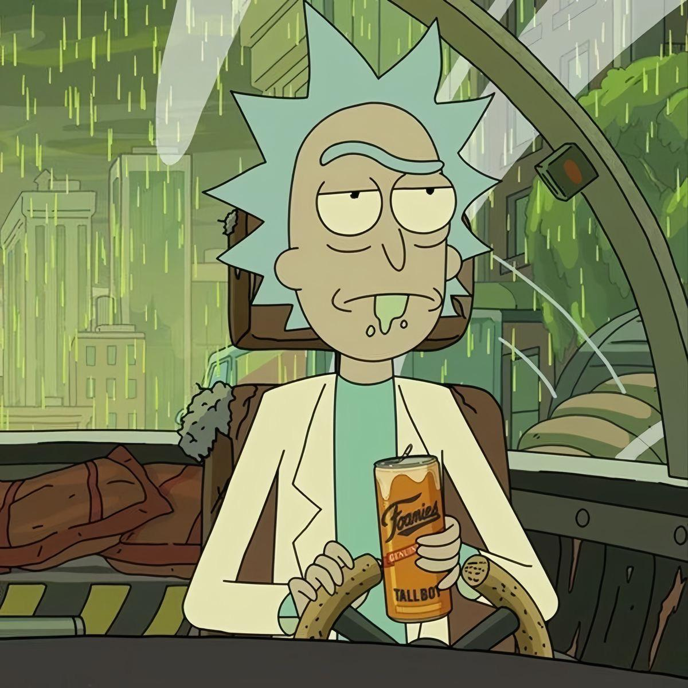
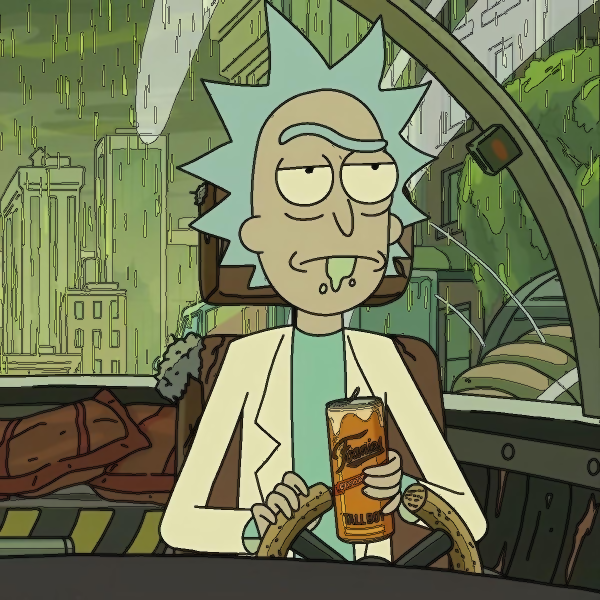

# 🦸‍♂️ Filtro de Cómic en Python

Este proyecto aplica un efecto de **cómic o caricatura** a imágenes utilizando Python y OpenCV. El filtro transforma fotos normales en imágenes con un estilo de cómic, resaltando bordes y simplificando colores para un acabado artístico.

## 🖼️ Ejemplo del efecto

| Imagen Original | Imagen con Filtro Cómic |
|-----------------|--------------------------|
|  |  |

> *Reemplaza las rutas anteriores con tus propias imágenes para mostrar ejemplos reales.*

---

## 🧰 Tecnologías utilizadas

- Python 3.x
- OpenCV (`cv2`)
- NumPy

---

## ⚙️ Instalación

1. Clona este repositorio:
   ```bash
   git clone https://github.com/tuusuario/filtro-comic-python.git
   cd filtro-comic-python
